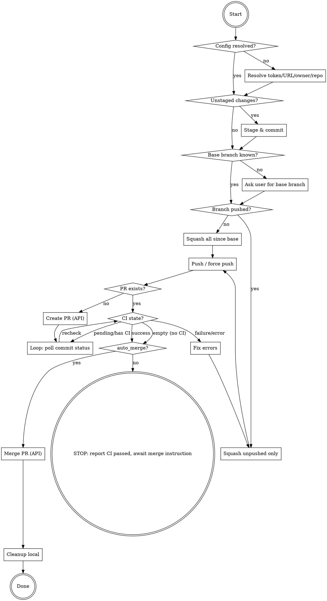

# Ship Branch (Gitea)

Full workflow: commit → squash → push → PR → CI → stop. **Do not merge unless explicitly asked.**

Same flow as `ship-branch`, but the repo is on a self-hosted **Gitea** instance: there is no `gh` CLI, so PR / CI / merge use the Gitea REST API via `curl` + `jq`. Authentication is the `GITEA_TOKEN` environment variable.

If the user invoked this skill with "merge" (e.g. `/ship-branch-gitea merge` or "ship branch and merge"), set `auto_merge=true` and do **not** stop after CI — continue straight through merge and cleanup without asking.



## Configuration

Resolve these once, up front. **The API host is NOT derivable from an SSH remote** (Gitea SSH remotes are often a bare IP with a non-HTTP port, e.g. `ssh://git@194.164.72.200:30980/...`). Do not probe the SSH host/port for the API.

```bash
# Token (required) — must already be exported
test -n "$GITEA_TOKEN" || { echo "GITEA_TOKEN not set"; exit 1; }

# Owner/repo from the remote path — works for ssh://, scp (git@host:owner/repo), and https remotes
read OWNER REPO < <(git remote get-url origin | sed -E 's#\.git$##; s#.*[:/]([^/]+)/([^/]+)$#\1 \2#')

# API base URL: prefer $GITEA_URL; else derive ONLY from an https remote; else ask the user.
if [ -n "$GITEA_URL" ]; then
  BASE_URL="$GITEA_URL"
else
  REMOTE=$(git remote get-url origin)
  case "$REMOTE" in
    https://*) BASE_URL=$(echo "$REMOTE" | sed -E 's#(https://[^/]+)/.*#\1#') ;;
    *) echo "Cannot derive API URL from non-https remote. Set GITEA_URL or ask the user."; exit 1 ;;
  esac
fi
API="$BASE_URL/api/v1"

# Reusable API helper
api() { curl -s -H "Authorization: token $GITEA_TOKEN" -H "Content-Type: application/json" "$@"; }

# Verify auth + repo access before doing anything mutating
api "$API/repos/$OWNER/$REPO" | jq -r '.full_name, .default_branch'
```

## Commands

**Stage & commit:**

```bash
git add -A && git commit -m "<message>"
```

**Squash — not yet pushed:**

```bash
git reset --soft "$(git merge-base HEAD <base-branch>)"
git commit -m "<message>"
git push -u origin <branch>
```

**Squash — already pushed:**

```bash
git reset --soft "HEAD~$(git rev-list --count origin/<branch>..HEAD)"
git commit -m "<message>"
git push --force-with-lease
```

**Find existing open PR for this branch** (idempotency — avoid duplicate PRs):

```bash
BRANCH=$(git rev-parse --abbrev-ref HEAD)
PR_NUMBER=$(api "$API/repos/$OWNER/$REPO/pulls?state=open" | jq -r --arg b "$BRANCH" '.[] | select(.head.ref==$b) | .number' | head -n1)
```

**Create PR** (only if `PR_NUMBER` is empty):

```bash
PR_NUMBER=$(api -X POST "$API/repos/$OWNER/$REPO/pulls" \
  -d "$(jq -n --arg h "$BRANCH" --arg b "<base-branch>" --arg t "<title>" --arg body "<body>" \
        '{head:$h, base:$b, title:$t, body:$body}')" \
  | jq -r '.number')
```

**Poll CI — use /loop (dynamic, no interval):**

Gitea CI (Gitea Actions or external) reports a **combined commit status**. Gate on its `state`:

- `success` → CI passed
- `pending` → still running
- `failure` / `error` → CI failed
- `""` (empty) → no CI configured for this commit; treat as nothing to wait for

Invoke the `loop` skill with no interval (dynamic mode). It uses `ScheduleWakeup` and self-terminates — just don't schedule the next wakeup when done (do NOT use blocking `sleep` loops). On each wakeup:

```bash
SHA=$(git rev-parse HEAD)
STATE=$(api "$API/repos/$OWNER/$REPO/commits/$SHA/status" | jq -r '.state')
```

1. `STATE=success` or `STATE=""` → proceed to `auto_merge?`, do NOT schedule next wakeup
2. `STATE=failure` or `STATE=error` → list failing checks (below), fix errors, re-squash, do NOT schedule next wakeup
3. `STATE=pending` → schedule next wakeup (60s)

List failing checks with their logs URL:

```bash
api "$API/repos/$OWNER/$REPO/commits/$SHA/statuses" \
  | jq -r '.[] | select(.status=="failure" or .status=="error") | "\(.context): \(.target_url)"'
```

**Merge** (standard merge commit; only when `auto_merge=true` or after explicit instruction):

```bash
PR_TITLE=$(api "$API/repos/$OWNER/$REPO/pulls/$PR_NUMBER" | jq -r '.title')

api -X POST "$API/repos/$OWNER/$REPO/pulls/$PR_NUMBER/merge" \
  -d "$(jq -n \
        --arg title "Merge pull request #$PR_NUMBER from $OWNER/$BRANCH" \
        --arg msg "$PR_TITLE" \
        '{Do:"merge", MergeTitleField:$title, MergeMessageField:$msg, delete_branch_after_merge:true}')"
```

`delete_branch_after_merge:true` removes the remote branch — no separate delete call needed. A `200`/empty response means success; a JSON body with a `message` means failure (read it).

**Cleanup local** (always runs after merge):

```bash
git checkout <base-branch> && git pull
git branch -d <branch>
```

## Common Mistakes

- **Deriving the API URL from the SSH remote** — the SSH host/port is not the HTTP API. Use `$GITEA_URL`, an https remote, or ask the user.
- **Blocking `sleep` loops to poll CI** — the harness blocks foreground `sleep`. Use the `loop` skill in dynamic mode.
- **Lowercase `do`/`mergeTitleField`** — Gitea's merge body fields are `Do`, `MergeTitleField`, `MergeMessageField` (capitalized).
- **Creating a duplicate PR** — always check for an existing open PR on the branch first.
- **Treating empty `state` as a failure** — `""` means no CI ran for that commit, not that CI failed.
